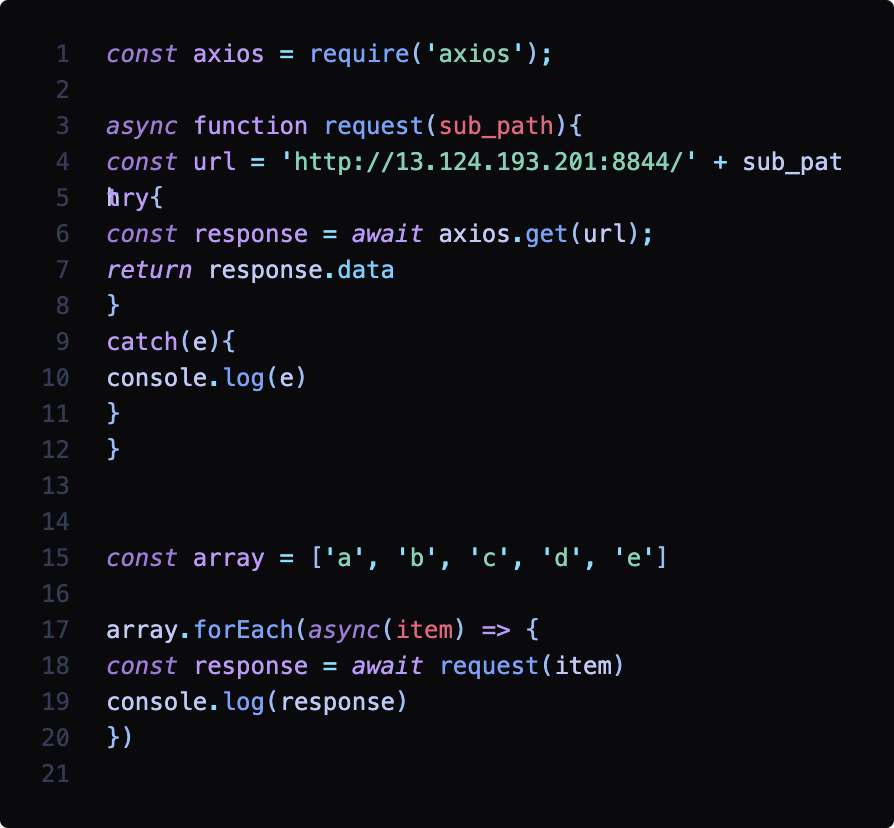
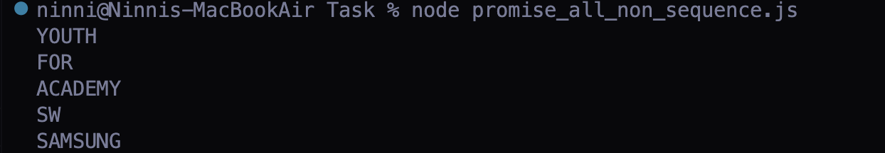

# JS 비동기 처리를 다루는 방법 (Promise vs async / await )

> 자바스크립트의 비동기 처리란 무엇인가?

## ✅ 동기 / 비동기

- 동기 : 순차적으로 동작하는 방식 (직렬식 수행), blocking 방식
- 비동기 : 비순차적으로 동작하는 방식 (병렬식 수행), non-blocking 방식

## ✅ 비동기 처리

- setTimeout같은 함수들을 사용하면, JS 코드는 항상 순차적으로 실행될 것이라는 예상에서 벗어난 결과를 얻게 된다.
- 동기식 컨셉으로 이미지, 영상 로딩이 완료되기 전까지 text가 하나도 출력되지 않는다면 사용자는 많은 불편함을 느끼게 된다.
- 다양하고 방대한 데이터를 웹 페이지에 불러오기 위해서는 비동기 처리가 사용된다.
- 이전에 선언된 코드의 종료를 기다리지 않고 동시에 실행하는 로직이 필요하다.

## ✅ 비동기 함수의 동기식 처리

- 특정 코드를 먼저 실행하거나 나중에 실행하는 순서를 정할 필요가 있다.
- 비동기코드를 동기식으로 사용해야 하는 경우가 있다.
  > callback, promise, async/await의 등장

## ✅ 콜백을 사용하는 이유?

- 자바스크립트의 비동기적 특성에 의해 다음 명령어가 실행되기 전 다른 이벤트를 실행할 수 있다. 즉 `원치않는 결과를 산출할 수도 있다.`
- 따라서, 콜백을 사용하면 `비동기적인 특성을 동기적`으로 사용할 수 있도록 제어가 가능하다.
- 그러나 콜백지옥이라는 단점, 코드의 가독성과 디버깅을 어렵게 만드는 요인이 될 수도 있다.

## ✅ Promise

- Promise는 자바스크립트에서 비동기 처리에 사용되는 `객체`다.
- 내용은 실행되었으나 결과를 아직 반환하지 않은 객체라고 이해하면 된다.

```
Promise.all([promise1, promise2, promise3]).then().catch()
```

`Promise.all()`이라는 구문을 통해 파라미터로 포함되는 모든 함수가 이행되는 것을 체킹할 수 있다.

### Promise의 3가지 상태

- Pending(대기) : 비동기 처리 중 (완료 전)
- Fulfilled(이행) : 비동기 처리 완료
- Rejected(실패) : 비동기 처리 오류 / 실패

### Promise 사용 예시

```
const condition = true;
const promise = new Promise((resolve, reject) => {
  if (condition) {
    resolve('resolved');
  } else {
    reject('rejected');
  }
});

promise
  .then((res) => {
    console.log(res);
  })
  .catch((error) => {
    console.error(error);
  });
```

- 하나의 변수로 해당하는 Promise를 관리하는 것이 가독성도 좋고 유지보수하기도 좋다.
- new Promsie(...)로 Promise 객체를 새롭게 생성 -> 생성자는 함수와 동일하게 동작하므로 괄호를 써서 함수를 호출하는 것과 같다.
- 생성자는 특별한 함수 하나를 인자로 받는다. 여기서 인자로 들어가는 함수의 형태는 화살표 함수다.
- 이 특별한 함수는 = executor
- executor은 첫번째 인자로 resolve 두번째로 reject를 받는다.
- resolve는 executor 내에서 호출가능한 또 다른 함수다.
- resolve를 호출하면 '비동기 성공'
- reject를 호출하면 '비동기 실패'
- then 메소드는 해당 Promise가 성공했을 때 동작을 지정한다. 인자로 함수를 받는다
- catch 메소드는 해당 Promise가 실패했을 때 동작을 지정한다. 인자로 함수를 받는다

## ✅ Promise.all()

여러 비동기 작업을 동시에 처리하여 다루고자 할 때 Promise.all을 사용한다.
Promise.all은 대괄호로 묶어 각 비동기 함수를 배열처럼 작성한다.
즉, 여러 비동기 작업들이 병렬적으로 처리가 된다.

## ✅ Promise.race()

제일 빨리 수행된 함수를 찾는다.
ex) 페이지에 용량이 큰 이미지를 여러개 띄우는 창을 생각해보자. 사용자에게 빈화면을 보여주기보다는 제일 빨리 로드된 이미지라도 보여줘야 하는 그런 상황에 사용하면 된다.

## ✅ async / await

가장 최근 나온 비동기 처리 문법으로, 기존의 callback이나 Promise의 단점을 해소하고자 만들어졌다. callback 지옥, then() 지옥

`await`를 통해 `Promise` 반환 값을 받아올 수 있다.

```
const variable = await promise;
```

await는 async 함수 안에서만 동작한다.

### async

- 함수에 async 키워드를 선언하면 해당 함수를 AsyncFunction 객체를 반환하는 하나의 비동기 함수로 정의한다.
- 비동기 함수는 이벤트 루프를 통해 비동기적으로 작동하는 함수로, 암시적으로 Promise를 사용하여 결과를 반환한다.
- 함수에 async 키워드를 선언하면 해당 함수의 반환값이 자동으로 Promise가 된다.
- async 함수의 결과값(return)은 Promise의 resolve(값)으로 호출된다.

### await

- await 키워드는 async function 내부에서만 사용이 가능하며 Promise를 기다리기 위해 사용된다.
- await문은 Promise가 이행(resolve)되거나 거부(reject)될 때까지 async 함수의 실행을 일시 정지하고, Promise가 이행(resolve)되면 async 함수를 일시 정지한 부분부터 실행한다. 이때, await 문의 반환값은 Promise에서 이행(resolve)된 값이 된다.
- Promise가 거부(reject)되면, await문은 reject된 값을 throw 한다.
- await 키워드는 비동기 함수내에서 사용하며, 해당 비동기 함수내에서 다른 비동기 함수를 실행할 때 사용한다.

### aysnc / await 사용 예시

```
(async () => {
  const condition = true;
  const promise = new Promise((resolve, reject) => {
    if (condition) {
      resolve('resolved');
    } else {
      reject('rejected');
    }
  });

  try {
    const result = await promise;
    console.log(result);
  } catch (err) {
    console.error(err);
  }
})();
```

익명함수 패턴을 사용했다.
async함수 내의 await를 통해 promise의 반환값을 result 변수에 담아 콘솔에 출력한다.

## ✅ 차이점

### 에러 핸들링

- promise를 활용시에는, .catch() 문을 통해 에러 핸들링이 가능하지만 async/await는 try-catch()문을 활용해야 한다.

### 코드 가독성

- 코드가 길어지면 길어질 수록 async/await를 활용한 코드가 가독성이 좋다.
- async/await는 비동기 코드가 동기코드처럼 읽히게 해준다.

## ✅ 비동기와 forEach

### Question

아래의 코드는 잘못된 코드지만, 의문점이 생겼다.
왜 함수의 실행 순서로 결과가 도출되지 않고 역순으로 값이 출력되는 걸까?  
  
함수의 실행순서가 아닌 순서로 결과값이 나온다  


### 비동기에는 forEach를 쓰면 안된다.

- forEach는 자신이 실행하는 callback함수가 비동기 작업을 하는지에 대해 아무런 관심이 없다.
- forEach에 의해 실행된 여러개의 callback들은 모든 callback이 완료될 때 까지 기다리고, 작업이 다 완료가 된다면 event loop에 의해 call stack으로 옮겨져 하나씩 실행된다.
- 즉, forEach는 배열을 돌며 callback을 호출하기만 한다면 맡은 바 임무를 다한것으로 생각하고 종료된다. 즉, 비동기작업의 처리상태를 추적하지 못하고 이후의 흐름을 제어하기 어려워진다.
- 즉 forEach를 가지고는 이전 callback이 끝난 후 다음 callback이 순차적으로 실행되는 결과를 얻을 수 없게 된다.
- **결론**: 배열의 비동기작업에 forEach를 사용하면 직렬처리든, 병렬처리든 올바르게 작동하기 힘들다.

### 대안

`forEach` : 정말 forEach를 쓰고 싶다면 forEach자체를 async로 함수로 만들고, 각 callback을 await하게 만들면 가능하다.  
`for..of..` : 하지만 그보다도 for..of를 쓰는게 더욱 현명하다. 그러나 직렬로 처리하기 때문에 시간이 많이 잡아먹힌다.  
`Promise.all()` : 그러므로 순서가 중요하지 않다면, map과 Promise.all()을 사용하자, 병렬로 처리한다.

## ✅ 결론

- 배열의 요소에 비동기 작업을 실시할 경우 `순차처리(직렬처리)`와 `비순차처리(병렬처리)`중 어떤 방식이 필요하느냐에 따라 접근법이 달라진다.
- `forEach`를 사용할때는 callback이 async하더라도 전체 `method는 async하지 않음`을 유의해야 한다.
- 일반적으로 순차처리는 일반 for문이나 for...of문을 통해, 병렬처리는 map과 promise.all 혹은 reduce를 이용하는게 현명하다.

### 출처

- [JavaScript: async/await with forEach()](https://codeburst.io/javascript-async-await-with-foreach-b6ba62bbf404)
- [Does Promise.all Execute in Parallel? How Promise.all Works in JavaScript](https://javascript.plainenglish.io/does-promise-all-execute-in-parallel-how-promise-all-works-in-javascript-fffc2e8d455d)
- [[JS] forEach 함수는 async 함수를 기다려주지 않는다](https://constructionsite.tistory.com/43)
- [forEach 는 async/await 을 기다려주지 않는다](https://blog.naver.com/kmscompany/223128101097)
- [배열에 비동기 작업을 실시할 때 알아두면 좋은 이야기들](https://velog.io/@hanameee/)
- [Typescript에서 await/async forEach, map, reduce 사용하기](https://kohm.tistory.com/28)
