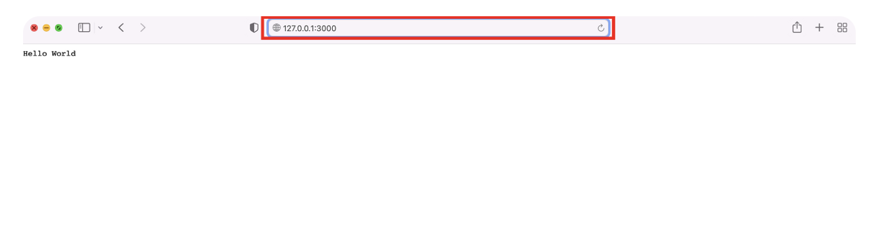

## Node.js

> Node.js는 Chrome V8 javascript 엔진으로 빌드된 **Javascript 런타임**이다. Node.js는 **웹 서버의 개념이 아닌** javascript로 서버를 구축하고, 서버에서 javascript가 작동되도록 해주는 런타임 환경(플랫폼)이다.

💡 [웹서버(web server)?](./Webpage_website_web_server.md) - HTTP 또는 HTTPS를 통해 웹 브라우저에서 요청하는 HTML 문서나 오브젝트(image, file)등을 전송해주는 서비스 프로그램이다.<br>
💡 컴파일(compile)? - 프로그래밍 언어는 주로 고급언어로, 기계가 바로 이해할 수 없기에 고급언어로 작성된 소스코드를 기계어로 변환하는 과정을 컴파일이라고 한다.<br>
💡 런타임(runtime)? - 프로그램이 실행되는 동안의 시간을 가리킨다. 프로그램이 메모리에 로드되고, 사용자의 입력을 받고, 연산을 수행하는 과정들이 런타임에서 이루어진다. <br>

### Node.js의 장점

- 단일 스레드(Single-Thread)의 논 블로킹(Non-blocking I/O) 이벤트 기반 비동기 방식으로 처리되어 높은 성능을 가지고 있다.
- **내장 HTTP 서버 라이브러리를 포함**하고 있어 웹 서버에서 아파치 등의 별도 소프트웨어 없이 동작하는 것이 가능하며, 이를 통해 웹서버의 동작에 있어 더 많은 통제를 가능하게 한다.
- Javascript언어로 Front-end 뿐만 아니라 Back-end 개발 환경을 구성할 수 있어, 생산성이 높다.
- **다양한 패키지 매니저(npm: Node Package Manager)** 를 기반으로, **다양한 모듈(패키지)를 제공**하여, 필요 라이브러리에 대해 설치하고 사용할 수 있어 효율이 좋다.

💡 블로킹(blocking I/O)? - I/O가 동작되는 동안, 다른일을 처리하지 못하는 상태. 함수가 모든일을 마무리 지을 때까지 다음 처리가 안되는 것<br>
💡 논 블로킹(Non-blocking I/O)? - I/O가 동작을 하면서 request를 받으면 바로 다음 처리에 요청을 보내놓고, 다른 작업을 처리하다가 먼저 요청한 작업이 끝나면 이벤트를 받아서 응답을 보내는 것이다.

### Node.js의 단점

- Node.js의 모든 API는 **비동기 기반의 처리방식** 이므로, 서버의 로직이 복잡한경우 콜백함수의 늪에 빠질 수 있다.
- 단일스레드(Single Thread)이기에, 하나의 작업이 오래걸리는 웹서비스의 경우 어플리케이션의 성능이 저하된다.
- **해당코드를 수행을 해야만 코드에서 에러가 났는지 확인**이 가능하기에, 에러가 날 경우 프로세스 자체가 내려갈 수 있다.
- 세션을 공유할 경우 redis 같은 부가적인 인프라가 필요하다.

### Node.js 만을 이용한 서버 구성 방법

💡 Node.js는 node 설치 이후에 javascript 파일을 즉시 실행할 수 있기에 간단한 환경구성이 가능하다.

**_최초 환경 구성 - terminal_**

```
# node.js 설치
$ brew install node@16.13.1

# 특정 위치에 server.js 파일 생성
$ touch server.js
```

**_server.js 소스코드_**
해당 소스코드는, 127.0.0.1(localhost)에 임의의 port를 지정하여서 서버를 구성하는 방법을 설명한다.

```
const http = require('http');

const hostname = '127.0.0.1';
const port = 3000;

const server = http.createServer((req, res) => {
  res.statusCode = 200;
  res.setHeader('Content-Type', 'text/plain');
  res.end('Hello World');
});

server.listen(port, hostname, () => {
  console.log(`Server running at <http://$>{hostname}:${port}/`);
});
```

**_실행 방법 및 결과_**

```
# 생성한 파일을 node.js로 수행시킨다
$ node server.js
```



## 출처

[[Node] Node.js 이해하기-1(정의, 장단점)](https://adjh54.tistory.com/44#)
[[번역] Node.js 비동기 흐름 제어 및 이벤트 루프](https://velog.io/@surim014/nodejs-asynchronous-flow-control-and-event-loop)
