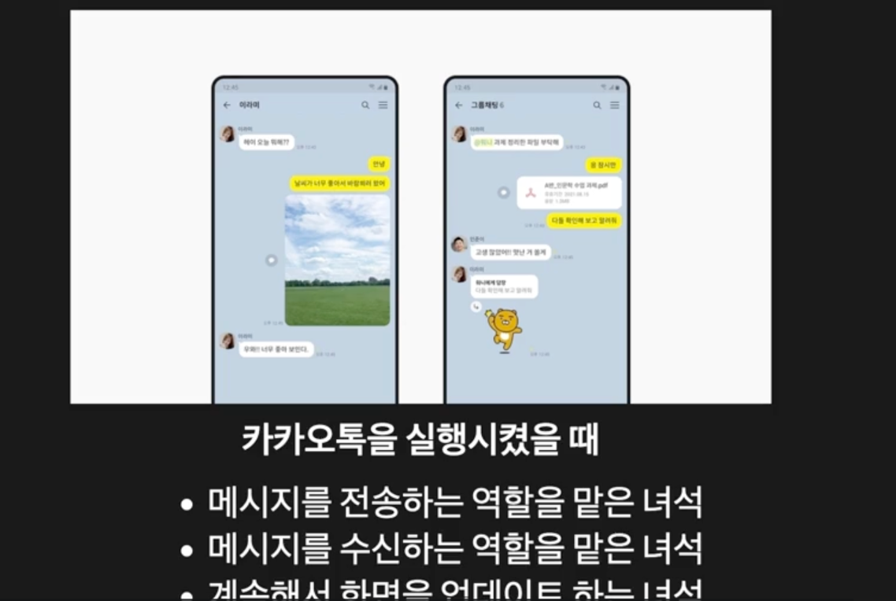
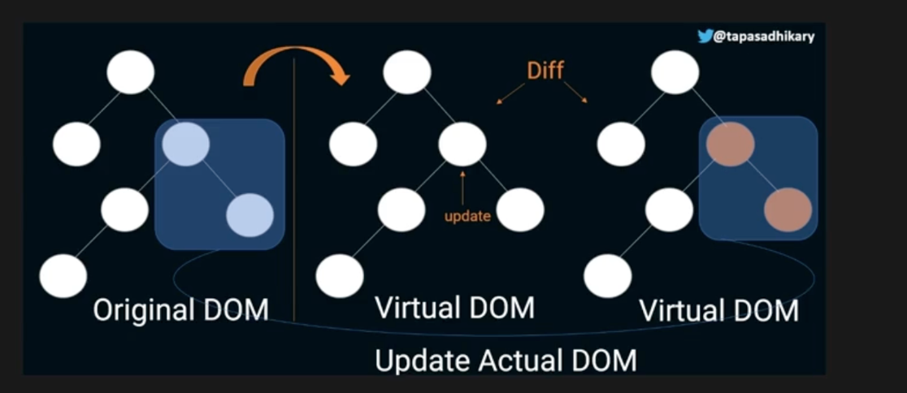
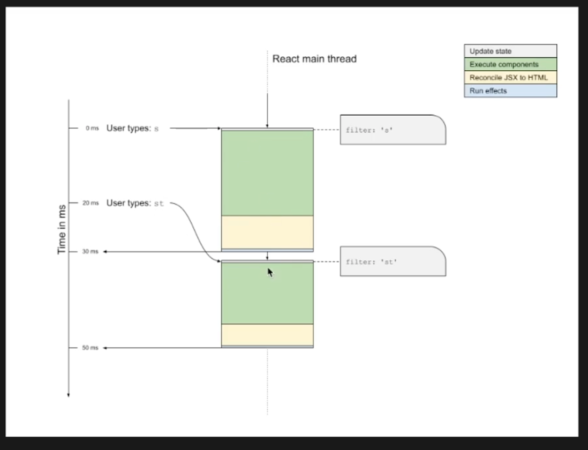

## 리액트 렌더링 원리

### Thread

- 쓰레드는 실행 흐름의 최소 단위
- 프로그램을 실행시키면 쓰레드는 맡은 일을 진행한다.
  
  > 여러개의 쓰레드는 프로세스가 제대로 실행되기 위해 필요한 작업을 맡아서 한다. 리액트 코드가 실행되는 브라우저에서는 **단 하나의 쓰레드**만 실행이 된다.

### React에서 1개의 Thread로 렌더링 하는 과정

1. 사용자 입력을 받아서 상태를 **업데이트**한다.
2. 상태변화를 감지한 후에 `render()` 함수를 실행한다.
3. **Reconcile** 과정을 수행한다. (jsx element를 html 코드로 변환하는 과정)
4. 등록된 effect를 실행한다.

### Reconcilliation

1. React는 **Virtual DOM**을 통해 필요한 element를 업데이트 한다.  
   Virtual DOM은 DOM을 Object로 만든 것이다.
2. 상태 변경으로 인해 UI가 업데이트 되어야 한다면 Virtual DOM에서 그 부분을 업데이트 한다.
3. 그 이후 최종적으로 실제 DOM에 UI를 업데이트 하면서 사용자에게 변환 부분이 보이게 한다.
   

### 여기서 문제, 렌더링에서는 어디가 가장 많은 시간이 걸릴까?

리액트 렌더링 과정에서는 2번과 3번사이
즉 **컴포넌트 실행과정(render()), 초록색**과 **Reconcilliation과정, 노란색**에서 많은 시간이 소요된다.

**따라서 이 문제를 어떻게 해결할 것인가?** 가 다음 챕터에서 다룰 내용이 된다.
