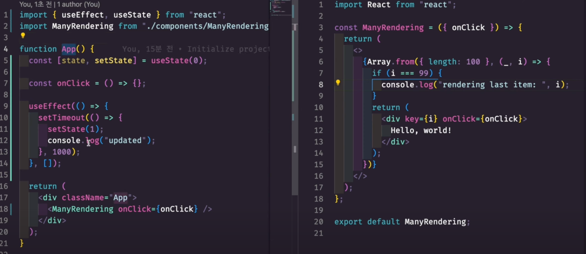
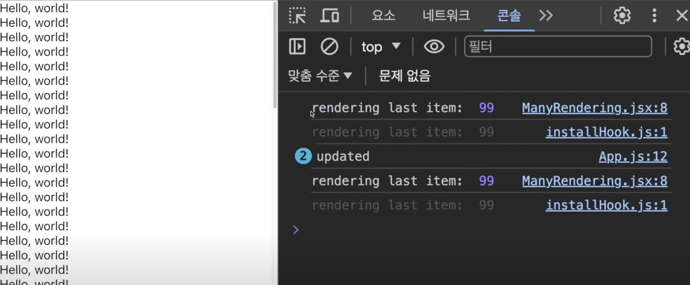
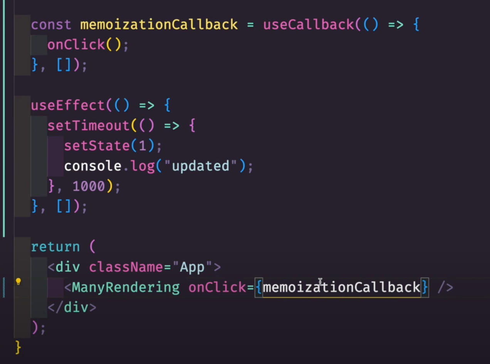
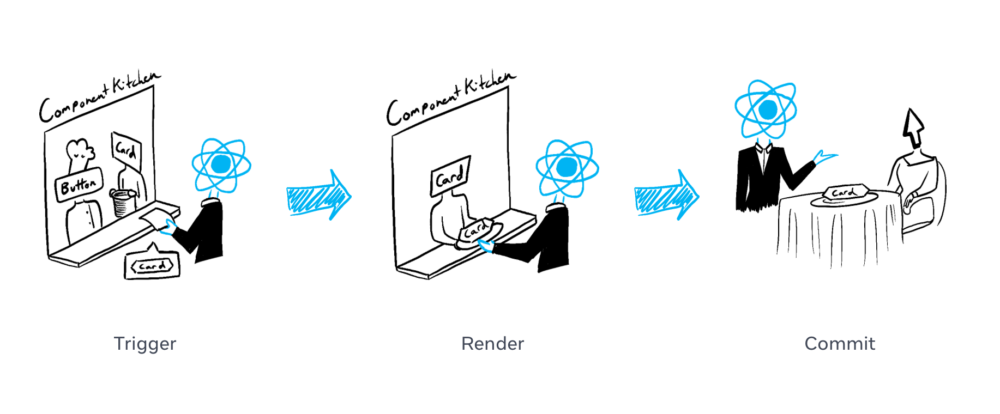
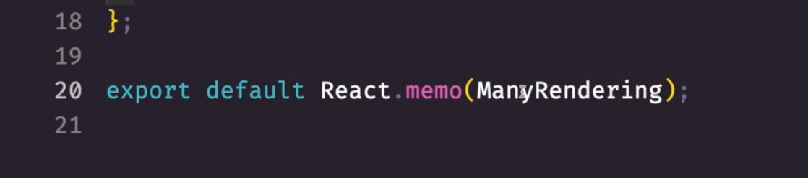
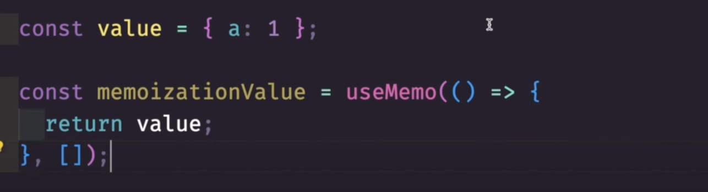

## 왜 useCallback, React.memo, useMemo를 사용할까? (리렌더링 줄이기 전략)

> 리액트를 사용하며 여러 리렌더링 이슈가 발생하는 경우가 많다. 이런 경우 어떻게 효과적으로 리렌더링을 피하거나 줄일 수 있을지를 알아보자.

- `App.js`파일 안에 `<ManyRendering />`이라는 여러번 렌더링 되는 컴포넌트가 있다.
- `<ManyRendering />` 컴포넌트는 `onclick`을 props로 받는다.
- 위의 console.log에 찍힌 값을 보면 렌더링이 두번 발생하는 것을 확인할 수 있다.

## 리렌더링이 발생하는 원인

### 리렌더링이 발생하는 조건

1. state(상태)의 변경
2. props의 변경
3. component 최초의 render

위의 코드에서, state는 바뀌긴 한다. 그러나 state는 `<ManyRendering />`과 관련이 없다.
심지어 state는 아무곳에서도 사용하지 않는다.
그러나 state가 변경됨에 의해, App.js는 다시 실행이 되고, 또한 `<ManyRendering />`이라는 컴포넌트도 다시 실행이 되며 중복 렌더링이 발생하게 된다.

### 원인

**props가 일정하지 않다.**
`<ManyRendering />`에 전달되는 onClick 함수를 보면, 훅이 사용되지 않고 선언된
어떤 함수나 값은 매번 App() 파일이 다시 실행될 때 마다 새로 할당이 된다.
매번 렌더링이 될 때마다 메모리의 다른 곳에 저장이 된다.
쉽게 말하자면 onClick 함수는 처음 A라는 곳에 생기고, 다시 실행되면 B라는 곳에 생기게 된다.
즉 `<ManyRendering />`의 props의 값이 변했다는 뜻이다.
그렇다면 props가 변경되지 않아야 한다. 어떻게 해결을 해야할까?

## useCallback

이를 해결하기 위해 바로 메모이제이션한 콜백함수를 만든 뒤 전달을 하는 것이다.
useCallback이라는 함수는 어떤 함수를 리액트의 메모리 내에 할당을 하는 것이다.
따라서 다시 렌더링이 된다 하더라도, 해당 메모이제이션 된 함수의 **의존성이 바뀌지 않는 한** 해당 함수는 렌더링 전과 이후나 "동일한" 함수가 된다.

그러나, 여전히 Props가 변경되지 않는다 해도.

여전히 같은 문제가 발생한다! 왜그럴까?

## Render & Commit

### 두번째 원인

리액트는 렌더링 과정에서 2가지 페이즈를 거친다. (정확하게는 3단계의 phase라고 생각한다.)

예를 들자면, 컴포넌트는 요리사라고 볼 수 있다. 주방에서 재료들을 맛있게 조합해 하나의 요리를 완성한다. 이러한 맥락에서, 리액트는 손님으로부터 주문을 받고 컴포넌트에게 주문을 전달하는 웨이터라고 할 수 있다. 이러한 요청과 서빙의 과정에서 UI는 3가지의 단계를 밟는다.

1. **Triggering** a render (손님으로부터 주문을 받아 주방으로 전달한다.)
   - 렌더링 호출의 과정
   - initial render : createRoot를 호출하거나(initial render의 경우)
   - rerender : state를 `set` function을 통해 업데이트 한다.(re-render의 경우)
2. **Rendering** the component (주방에서 주문된 음식을 준비한다.)
   - 렌더링의 과정
   - components들을 호출하는 과정
   - initial render : root component를 호출한다.
   - subsquent render : 렌더링을 유발한 상태 업데이트가 있는 함수 컴포넌트를 호출한다(후속 render라면)
3. **Commiting** to the DOM (테이블에 요청받은 주문된 음식을 배치한다.)
   - 최신의 렌더링 output과 DOM을 비교하고 변경 사항이 있는 DOM nodes에 적용하는 과정
   - initial render : 리액트는 `appendChild()`라는 DOM API를 이용하여 모든 DOM nodes들을 스크린에 그린다.
   - re-render : 리액트는 DOM이 최신의 rendering 결과와 일치하도록 최소한의 필수 수행사항(렌더링동안 계산된)을 적용할 것이다.

_중요_ 리액트는 오직 render 결과와 차이가 있는 DOM nodes만 조작한다.

memoization을 통해 `commit phase`는 최적화를 했지만, 아직 `render phase`가 최적화되지 않은 상황이다.

## React.memo

이 상황에서, 리액트는 `React.createElement`를 통해서(리액트는 JSX문법을 사용해 해당 컴포넌트를 return하는 함수를 호출하는 등)render phase를 호출하는데, 이 부분이 아직 해결이 되지 않은 상황이다.
useCallback을 통해 commit phase에서는 불필요한 요청을 제거했으나, render phase의 문제가 해결이 안된 것이다.
이를 해결하기 위해

`React.memo()`로 export되는 해당 컴포넌트를 감싸준다.
이렇게 되면 `<ManyRendering />`에 전달되는 props가 바뀌지 않는 한, 다시 렌더링이 될 필요 없이
컴포넌트의 내용을 기억하게 된다.

## useMemo

useCallback과 비슷하지만, 함수가 아닌 어떤 '값'을 기억하는 역할을 한다.

여기서 `value` 또한 reference type 이기 때문에 렌더링 될 때마다 새로운 메모리에 생기게 된다.
이를 방지하기 위해 `useMemo`를 이용해 값을 기억할 수 있다.

## 주의할 점

그러나 useCallback, React.memo, useMemo 모두 어떤 상황에서 필수적으로 좋은 것은 아니다.
이들은 절대 '공짜'가 아니다. 상황과 때에 따라 쓰임새가 다르고, 어떤 경우에서는 굳이 메모리의 자리를 차지하지 않을 필요가 있는 경우도 많다. 이 점에 유의해서 사용하는 것이 좋다.

## 출처

[[React] Render and Commit](https://react.dev/learn/render-and-commit)
[왜 useCallback, React.memo, useMemo를 사용할까?(리렌더링 줄이기 전략)](https://www.youtube.com/watch?v=HHKV9XbXUOw)
