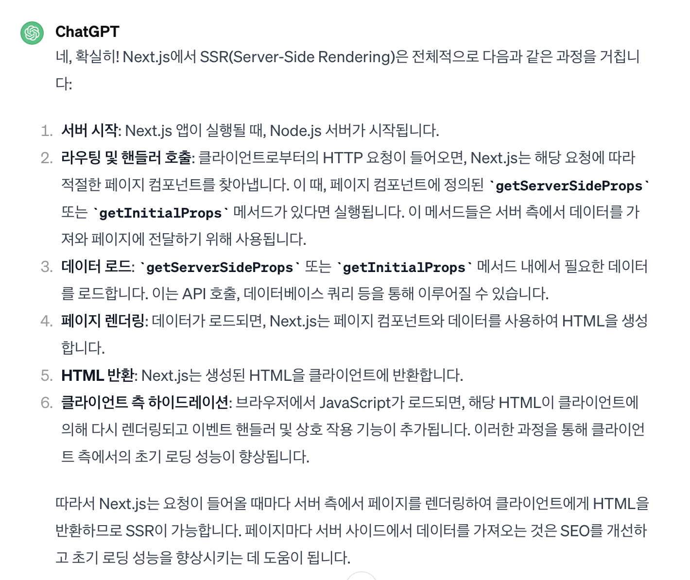
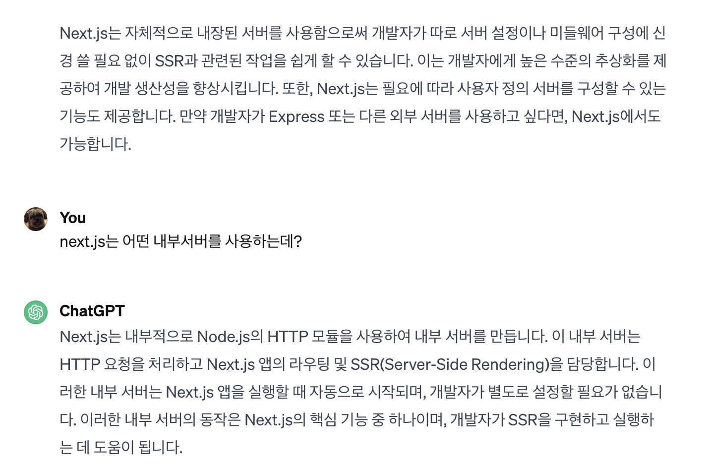
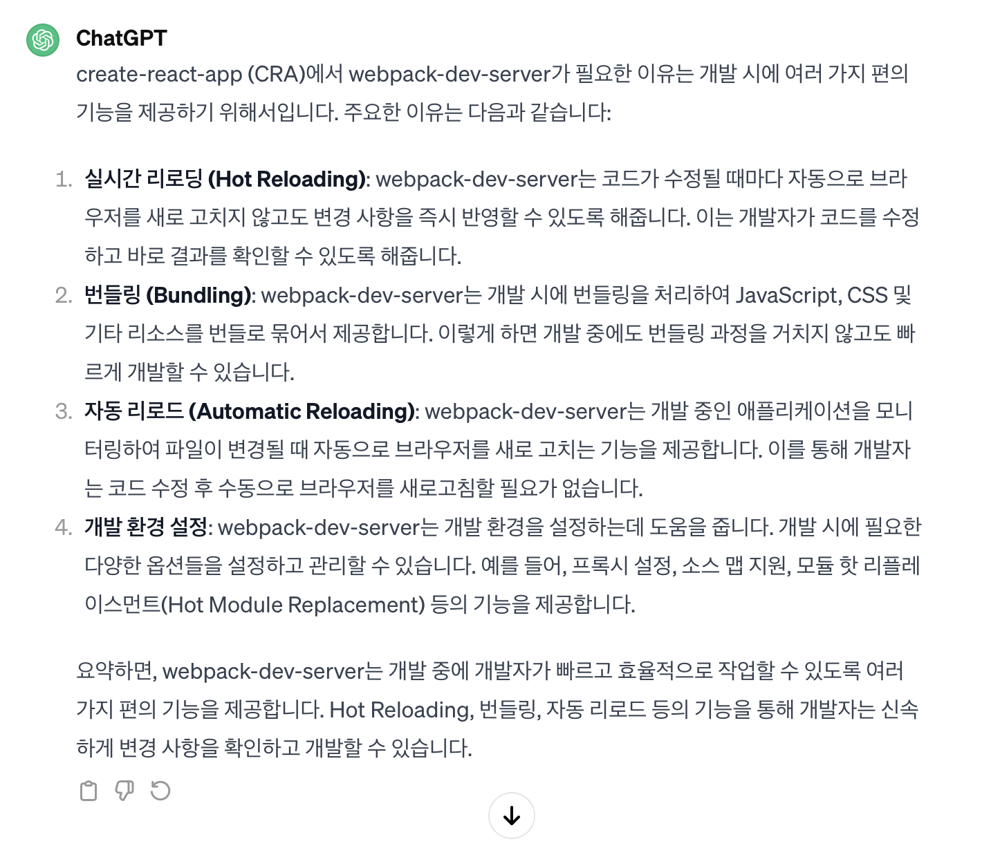

## 프론트서버, 웹서버, 백엔드서버, http서버 그게 뭔데?

> 공부를 하다가 서버에 대해 제대로 이해를 못 하고 있다는 결론이 내려졌다. 웹 서버, 프론트서버, 백엔드서버, http서버 어디서 들은건 많은데 한 곳에 제대로 개념이 잡히지 않는다. 더불어 node.js는 서버가 아니야..? 이런 나를 위해 제대로 정리해보는 서버 탐방기

## 서버(server)

### 내가 알고 있던 서버

- 백엔드의 서버
- DB의 데이터를 읽어오거나 추가/삭제 하는 부분
- API 통신을 담당하는 부분

### 나의 궁금증

- Next.js를 사용할때 SSR, SSG 등을 할 수 있다는데, 즉, 서버에서 HTML을 생성하거나 컴포넌트를 해석할 수 있다는데 여기서의 '서버'는 어디인가?
- Next.js가 production 단계로 빌드된다면, 빌드 이후 Next.js 서버는 도대체 어떻게 작동하는가?
- API 통신은 주어진 엔드포인트에 HTTP 요청을 보내 이루어진다, 서버에 HTML 수신을 위한 엔드포인트가 따로 있는 것도 아니고, 애초에 서버가 어떤 환경인지도 모르는데 HTML을 만들 수 있나? 서버가 리액트 코드를 어떻게 이해하는걸까?

### 우선 chatGPT에게 물어보자

> gpt에게 next.js에서 ssr이 이루어지는 과정에 대해 물어보았다.
> 

> 뭔가 부족하다. 이때의 서버가 express 같은건지 물었다.
> 

즉 gpt의 답변에 근거하면, Next.js는 내부적으로 Node.js의 HTTP 모듈을 사용하여 내부서버를 생성한다.

그렇다면 Next.js의 내부서버는 뭘까?

### 서버를 찾아서

- **서버** - '클라이언트의 요청에 응답하는 프로그램'을 통칭한다.
- **프론트 서버** - HTML/CSS/JS 등 정적 파일 요청에 응답한다.
- **백엔드 서버** - DB조회와 데이터를 보내주고 연산한다.

```
정적 리소스 (static): 정적 리소스는 변화가 없는 리소스를 뜻한다. 즉, HTML, CSS, Javascript와 같이 미리 서버에 저장해두고 서버가 요청을 받으면 응답만 해주면 되는 것들을 뜻한다. 어느 사용자에게도 동일한 결과값을 보여준다.
동적 리소스 (dynamic): 동적 리소스는 누가, 언제, 어떻게 서버에 요청했는지에 따라 결과값을 다르게 보여주는 리소스를 뜻한다. 사용자에게 맞춤형 콘텐츠를 제공해줄 수 있게 된다. ex) 유투브의 추천 영상
```

- 백엔드 서버(API)는 DB 조회, 다양한 연산 로직들을 처리하는데만 집중하도록 해야한다.
- 웹서버(프론트서버)를 통해서 단순히 정적 컨텐츠를 응답해주는 역할을 맡기며 서버의 부하 방지를 할 수 있다.

- 우리가 CRA에서 `dev` 명령어를 사용하거나, CNA에서 `next dev`를 사용해 프로그램을 실행시키면 -> 작성된 소스코드를 바탕으로 개발서버가 실행되며, 각 페이지에 필요한 정적 리소스들을 브라우저로 보낼 수 있다.

- CRA에서는 webpack-dev-server를 사용하고, next의 경우에는 `자체적인 built-in 서버`를 사용한다.


